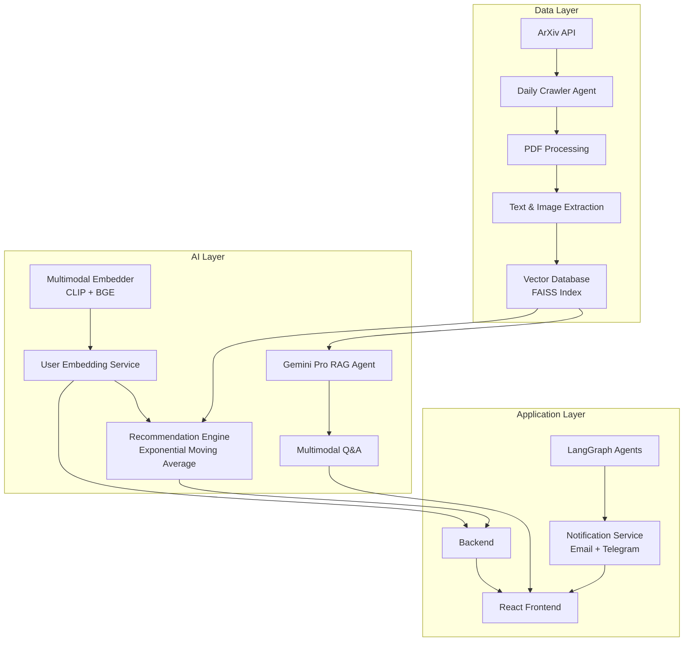

# 🔬 ArXiv PaperLens: Intelligent Research Paper Discovery System

<div align="center">

[](https://www.python.org/downloads/)

[](https://reactjs.org/)
[](https://opensource.org/licenses/MIT)

*An AI-powered research assistant that learns your preferences and delivers personalized ArXiv paper recommendations*

[📺 Demo Video](/demo/demo.mkv) 
</div>

---

## 🌟 Overview

**ArXiv PaperLens** is a sophisticated RAG (Retrieval-Augmented Generation) system that revolutionizes how researchers discover and interact with academic papers. Using advanced machine learning techniques, it creates personalized research experiences by understanding user preferences through implicit and explicit feedback mechanisms.

### ✨ Key Features

- 🤖 **Intelligent Paper Discovery**: Daily ArXiv crawling with ML-powered recommendations
- 🧠 **Multimodal RAG Chat**: Converse with papers using text and images via Google Gemini Pro
- 📊 **Advanced User Profiling**: Dynamic embedding updates using exponential moving average algorithms
- 🎯 **Personalized Recommendations**: Adaptive scoring system based on user interaction patterns
- 🔍 **Semantic Search**: FAISS-powered vector similarity search across 100k+ papers
- 📱 **Multi-Channel Notifications**: Email digests and Telegram bot integration
- 🎨 **Modern UI**: Responsive React frontend with real-time interactions

## 🏗️ System Architecture



## 🧮 Mathematical Foundation

### User Embedding Update Algorithm

The system employs an **Exponential Moving Average (EMA)** approach for updating user embeddings:

```
E_new = (1 - α) × E_current + α × E_weighted_papers
```

Where:
- `α`: Learning rate (default: 0.1)
- `E_weighted_papers`: Weighted average of paper embeddings based on interaction types
- Interaction weights: Like(+1.0), Bookmark(+0.8), Share(+0.6), View(+0.1), Dislike(-0.5), Delete(-0.9)

### Temporal Decay Mechanism

```
E_decayed = E × (decay_factor^(days_since_update/30))
```

This ensures recent preferences have higher influence while preventing embedding staleness.

### Relevance Scoring

Paper relevance is computed using cosine similarity:

```
relevance = (cosine_similarity(E_user, E_paper) + 1) / 2
```

Normalized to [0,1] range for intuitive scoring.

## 🚀 Quick Start

### Prerequisites

- Python 3.9+
- Node.js 16+ (for React frontend)
- Google API Key (Gemini Pro)
- PostgreSQL (for metadata storage)
- Docker (optional deployment)

### Installation

1. **Clone and Setup**
   ```bash
   git clone https://github.com/aymen-000/Paperlens
   cd Paperlans
   
   # Install Python dependencies
   pip install -r requirements.txt
   # or using uv (recommended)
   uv sync
   ```

2. **Environment Configuration**
   ```bash
   # Create .env file
   cat > .env << EOF
   GOOGLE_API_KEY = "your_key"
   CRAWLER_AGENT_MODEL_ID="gemini-2.5-flash"
   PROVIDER = "langchain_google_genai.ChatGoogleGenerativeAI"
   HUGGINGFACE_TOKEN_KEY = "your_token"
   JWT_SECRET_KEY = "your_key"
   ```

3. **Database Initialization**
   ```bash
   python scripts/init_db.py
   python scripts/seed_user.py
   ```

4. **Start Services**
   ```bash
   # Terminal 1: Backend API
   source .venv/bin/activate
   export PYTHONAPATH=.
   python3 backend/app/app.py
   
   # Terminal 2: Frontend (separate terminal)
   npm install 
   npm run dev
   
   ```

5. **Access Application**
   - Frontend: http://localhost:3000
   - Health Check: http://localhost:8000/health

## 🛠️ Technology Stack

### Backend
- **Flask**: High-performance async web framework
- **LangChain**: LLM orchestration and document processing
- **LangGraph**: Agent workflow management
- **FAISS**: Vector similarity search (Facebook AI)
- **PostgreSQL**: Metadata and user data storage
- **SQLAlchemy**: Database ORM

### AI/ML Components
- **Google Gemini Pro**: Multimodal language model
- **CLIP (OpenAI)**: Image-text understanding
- **BGE Embeddings**: Semantic text embeddings
- **Sentence Transformers**: Text encoding
- **PyTorch**: Deep learning framework

### Frontend
- **React**: Modern UI framework
- **Tailwind CSS**: Utility-first styling
- **Axios**: HTTP client


## 📊 Project Structure

```
Paperlens/
├── agents/                           # 🤖 AI Agent System
│   ├── system_agents/               # Core intelligent agents
│   │   ├── crawler.py              # ArXiv paper crawler
│   │   └── papers_rag.py           # Multimodal RAG system
│   ├── data/                       # Data processing & embeddings
│   │   ├── embedding.py            # User embedding service
│   │   ├── indexing.py             # Vector indexing
│   │   └── vector_db.py            # FAISS operations
│   ├── tools/                      # Agent utility tools
│   │   ├── crawler_tools.py        # PDF processing tools
│   │   └── rag_tools.py            # RAG helper functions
│   ├── prompts/                    # LLM prompt templates
│   └── config.py                   # Agent configurations
│
├── backend/                          # ⚡ FastAPI Application
│   └── app/
│       ├── models/                 # Database models
│       │   ├── user.py             # User profiles
│       │   ├── paper.py            # Paper metadata
│       │   ├── user_embedding.py   # User preference vectors
│       │   └── user_feedback.py    # Interaction tracking
│       ├── routes/                 # API endpoints
│       │   ├── papers_api.py       # Paper CRUD operations
│       │   ├── papers_bot.py       # RAG chat endpoints
│       │   └── user.py             # User management
│       ├── services/               # Business logic
│       │   ├── db_service.py       # Database operations
│       │   └── handle_interaction.py # User feedback processing
│       └── database.py             # SQLAlchemy setup
│
├── frontend/                         # 🎨 Next.js Application
│   ├── app/                        # Next.js App Router
│   │   ├── page.tsx                # Dashboard homepage
│   │   ├── login/                  # Authentication pages
│   │   └── signup/
│   ├── components/                 # UI components
│   │   ├── paper-feed.tsx          # Paper recommendation feed
│   │   ├── rag-panel.tsx           # Chat interface
│   │   ├── paper-search.tsx        # Search functionality
│   │   ├── settings-page.tsx       # User preferences
│   │   └── ui/                     # Shadcn/UI components
│   └── lib/                        # Utilities & API clients
│
├── faiss_index/                      # 🔍 Vector Database
│   ├── text_index.faiss            # Text embeddings (BGE)
│   ├── image_index.faiss           # Image embeddings (CLIP)
│   └── faiss_index/                # Legacy unified index
│
├── storage/                          # 📁 File Storage
│   ├── raw/                        # Original PDF papers
│   ├── processed/                  # Extracted content
│   │   ├── images/                 # Figures & diagrams
│   │   └── paper_*/                # Per-paper text & images
│   └── papers/                     # Downloaded PDFs
│
└── scripts/                          # 🛠️ Utility Scripts
    ├── init_db.py                  # Database initialization
    ├── seed_user.py                # Sample user creation
    └── run_agents.py               # Agent orchestration
```

## 🤖 Intelligent Agents

### 1. **ArXiv Crawler Agent**
- **Purpose**: Automated daily paper discovery
- **Capabilities**: 
  - Fetches 50+ papers daily based on user categories
  - PDF text extraction using PyPDF2
  - Figure/diagram extraction using PIL
  - Metadata enrichment and storage

### 2. **Multimodal RAG Agent**
- **Purpose**: Intelligent Q&A over research papers
- **Capabilities**:
  - Text-based semantic search
  - Image understanding and analysis
  - Context-aware response generation
  - Source attribution and citation

### 3. **User Learning Agent**
- **Purpose**: Preference modeling and adaptation
- **Capabilities**:
  - Real-time embedding updates
  - Interaction pattern analysis
  - Cold-start problem handling
  - Temporal preference drift detection

### 4. **Recommendation Engine**
- **Purpose**: Personalized content delivery
- **Capabilities**:
  - Multi-factor scoring algorithms
  - Diversity-aware recommendations
  - Category-based filtering
  - Performance analytics


## 🔧 Advanced Configuration

### Custom Categories and Weights

```python
# User category preferences with weights
CATEGORY_WEIGHTS = {
    "cs.AI": 0.2,          # Artificial Intelligence
    "cs.LG": 0.2,          # Machine Learning  
    "cs.CV": 0.2,          # Computer Vision
    "stat.ML": 0.4,        # Statistics ML
}
```

## 🤝 Contributing

We welcome contributions!

### Development Workflow
1. Fork the repository
2. Create feature branch (`git checkout -b feature/amazing-feature`)
3. Make changes with tests
4. Commit with conventional commits (`feat:`, `fix:`, `docs:`)
5. Push and create Pull Request

### Areas for Contribution
- 🔍 New embedding models integration
- 📊 Advanced analytics dashboards
- 🌐 Multi-language support
- ⚡ Performance optimizations
- 🎨 UI/UX improvements
- 🔍 User feedbacks 
- 🔍 notification channels

## 📄 License

This project is licensed under the MIT License - see the [LICENSE](LICENSE) file for details.

## 🙏 Acknowledgments

- **ArXiv** for providing open access to research papers
- **Google** for Gemini Pro API access
- **Hugging Face** for transformer models and embeddings
- **Facebook AI** for FAISS vector search
- **OpenAI** for CLIP multimodal understanding

## 🔮 Future Enhancements

### 🎯 Roadmap 

#### **Advanced Recommendation System**
- **🎰 Reinforcement Learning Recommender**
  - Multi-Armed Bandit algorithms for exploration vs exploitation
  - Deep Q-Network (DQN) for long-term user engagement optimization
  - Contextual bandits considering user state, time, and reading patterns
  - A/B testing framework for recommendation strategy evaluation

#### **Enhanced User Feedback & Analytics**
- **📊 Rich Feedback Mechanisms**
  - Star ratings and detailed paper reviews
  - Reading time tracking and attention heatmaps
  - Bookmark organization with custom tags and collections
  - Social features: following researchers, sharing reading lists
  - Citation network analysis for impact-based recommendations

- **🔬 Advanced Analytics Dashboard**
  - Personal research journey visualization
  - Topic evolution and trend analysis
  - Collaboration opportunity detection
  - Research gap identification using knowledge graphs

#### **Multi-Source Content Aggregation**
- **🌐 Diversified Content Sources**
  - **LinkedIn Research Posts**: Professional insights and industry research
  - **Twitter/X Academic Threads**: Real-time research discussions and preprints
  - **Google Scholar**: Citation networks and h-index tracking
  - **Research Gate**: Social academic networking integration
  - **Medium/Towards Data Science**: Practical implementations and tutorials
  - **GitHub Research Repos**: Code implementations and reproducible research

- **📡 Social Media Intelligence**
  - Tweet sentiment analysis for trending topics
  - LinkedIn post engagement metrics
  - Research influencer identification
  - Conference hashtag monitoring (#NeurIPS2024, #ICML2024)

#### **Phase 4: AI-Powered Research Assistant**
- **🤖 Advanced AI Capabilities**
  - Literature gap analysis using LLMs
  - Automated research proposal generation
  - Cross-paper concept linking and knowledge graphs
  - Research methodology recommendations
  - Collaborative filtering with similar researchers

- **🔗 Research Workflow Integration**
  - Zotero/Mendeley synchronization
  - LaTeX reference management
  - Notion/Obsidian knowledge base integration
  - Calendar integration for reading schedules
  - Email digest with personalized research summaries


---

## 📞 Support & Contact

- 🐛 **Issues**: [GitHub Issues](https://github.com/ayemn-000/Paperlens/issues)
- 💬 **Discussions**: [GitHub Discussions](https://github.com/ayemn-000/Paperlens/discussions)
- 📧 **Email**: aymne011@gmail.com

---

<div align="center">

**Built with ❤️ for the research community**

*Making academic research discovery intelligent, personalized, and delightful*

[⬆ Back to Top](#-arxiv-paperlens-intelligent-research-paper-discovery-system)

</div>
